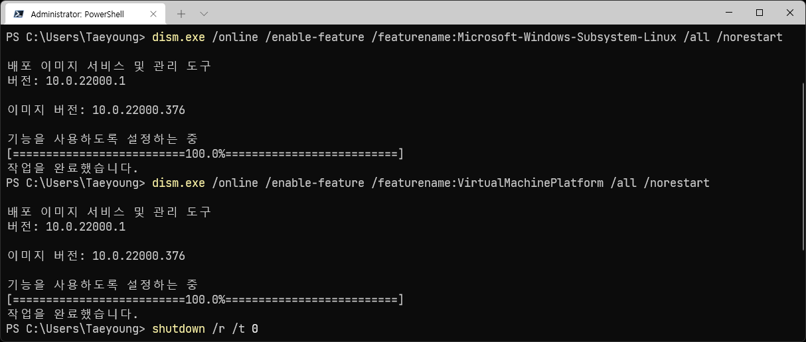
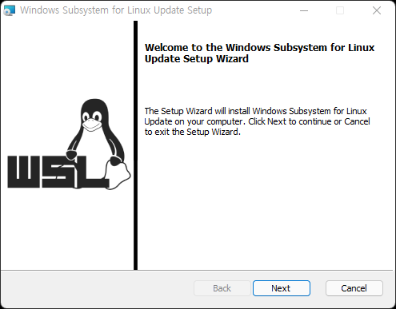
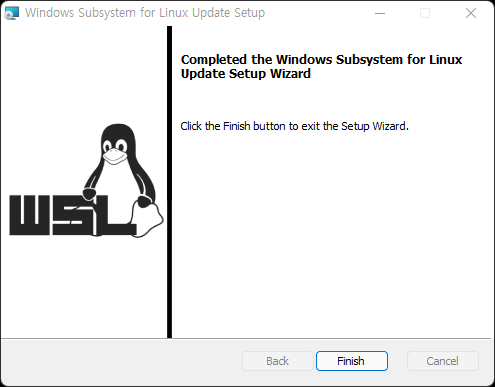
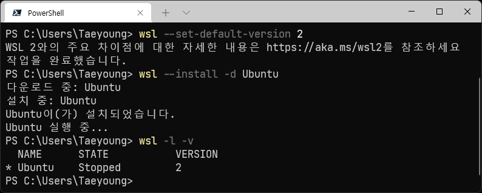
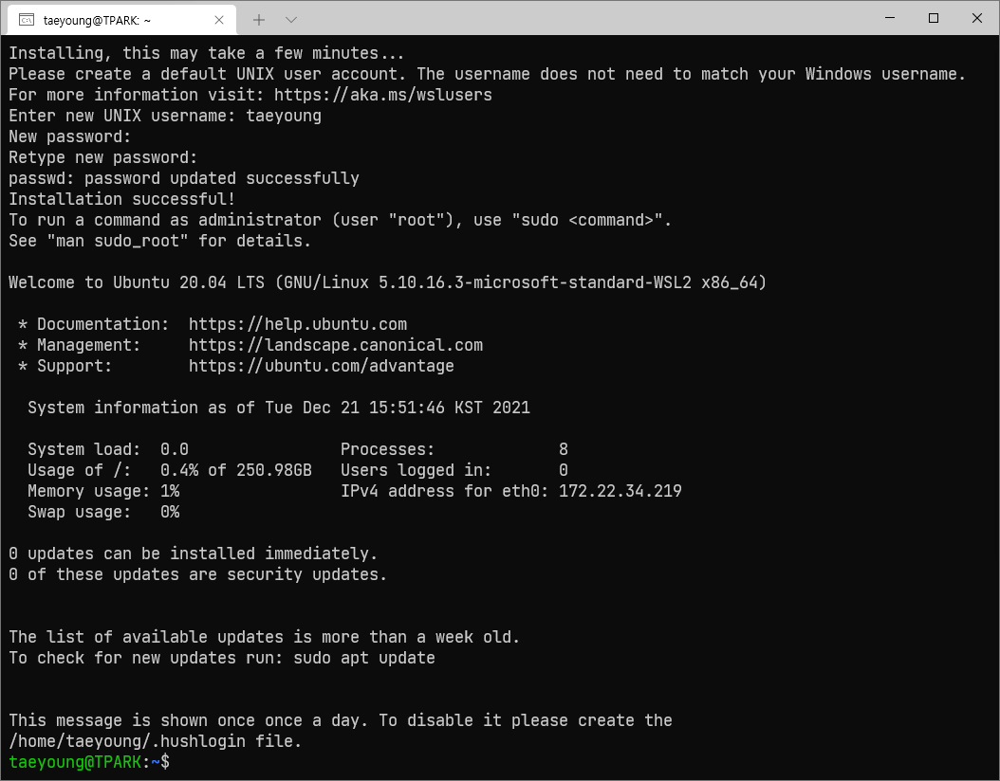

# WSL 2 설치

---

## 0. WSL(Windows Subsystem for Linux, WSL)?

- 윈도우에서 네이티브로 리눅스 실행 파일을 실행하기 위한 호환성 계층.
- ex) 윈도우에서 Linux용 git, jdk 실행 가능
- [위키](https://ko.wikipedia.org/wiki/%EB%A6%AC%EB%88%85%EC%8A%A4%EC%9A%A9_%EC%9C%88%EB%8F%84%EC%9A%B0_%ED%95%98%EC%9C%84_%EC%8B%9C%EC%8A%A4%ED%85%9C)
  참고

## 1. Linux용 Windows 하위 시스템 사용

- PowerShell or cmd를 관리자 권한으로 열고 다음 명령을 입력.

  ```PowerShell
  dism.exe /online /enable-feature /featurename:Microsoft-Windows-Subsystem-Linux /all /norestart
  ```

## 2. Virtual Machine 기능 사용

- PowerShell or cmd를 관리자 권한으로 열고 다음 명령을 입력.

  ```PowerShell
  dism.exe /online /enable-feature /featurename:VirtualMachinePlatform /all /norestart
  ```

## 3. 시스템 다시 시작

- PowerShell or cmd를 관리자 권한으로 열고 다음 명령을 입력.

  ```PowerShell
  shutdown /r /t 0
  ``` 



## 4. Linux 커널 업데이트 패키지 다운로드 및 설치

- [x64 머신용 최신 WSL2 Linux 커널 업데이트 패키지](https://wslstorestorage.blob.core.windows.net/wslblob/wsl_update_x64.msi)





## 5. WSL 2를 기본 버전으로 설정

- PowerShell을 열고 이 명령을 실행하여 새 Linux 배포를 설치할 때 WSL 2를 기본 버전으로 설정.

  ```PowerShell
  wsl --set-default-version 2
  ```

## 6. 배포판 설치


- 배포판 간단 요약

  |이름|용도|
  |---|---|
  |Debian|근본|
  |Ubuntu|대중화|
  |Kali|해커|
  |Alpine|경량화|

- Ubuntu 20.04.3 LTS 설치

  ```PowerShell
  wsl --install -d Ubuntu
  ```



