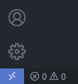
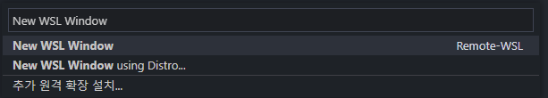

# VSCode 설정

---

## 1. WSL에 VSCode 확장팩 설치하기

- LOCAL이 아닌 WSL: UBUNTU에 설치
- [~/.vscode-server/extensions/]에 확장팩이 별도로 설치가 된다
- 기타 필요한 확장팩이 있다면 별도로 설치하여 사용

- [Remote -WSL](https://marketplace.visualstudio.com/items?itemName=ms-vscode-remote.remote-wsl)
- [Extension Pack for Java](https://marketplace.visualstudio.com/items?itemName=vscjava.vscode-java-pack)
- [Spring Boot Extension Pack](https://marketplace.visualstudio.com/items?itemName=Pivotal.vscode-boot-dev-pack)
- [Lombok Annotations Support for VS Code](https://marketplace.visualstudio.com/items?itemName=GabrielBB.vscode-lombok)

## 2. 원격 창 열기

- 좌측 하단에 있는 원격 창 열기 버튼 클릭

  

- 상단에서 New WSL Window 클릭

  

## 3. GitHub 에서 템플릿 다운 혹은 기존 프로젝트 사용

- GitHub 에서 다운받기

  ```bash
  git clone https://github.com/HappyICT/HappyTemplate.git 
  ```
